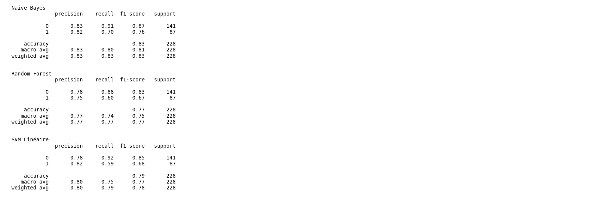

# Comparaison des matrices de confusion
**Date**: 2025-05-04_18-46-25

## Description
Ce graphique compare les performances de trois modèles sur un jeu de données binaire : Naive Bayes, Random Forest, et Régression Logistique.

## Visualisation

