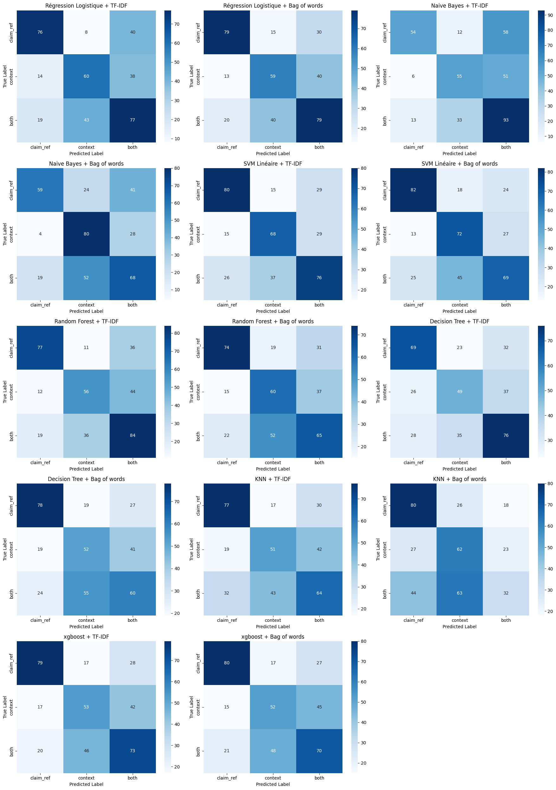

# classification multi-label STEP 2

Comme on peut le voir ci dessous, les baselines sont à seulement 50% de réussite 

ce n'est pas suffisant.

Cependant : 

En le faisant avec une classiffication binaires, et en supprimant la classe both 

## Visualisation

